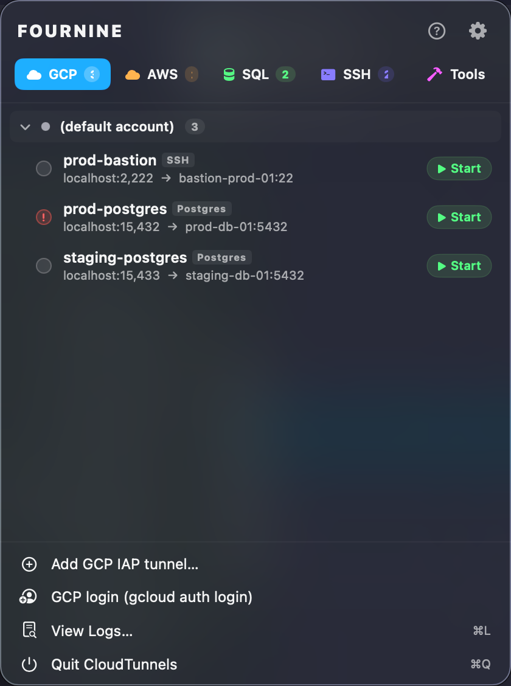
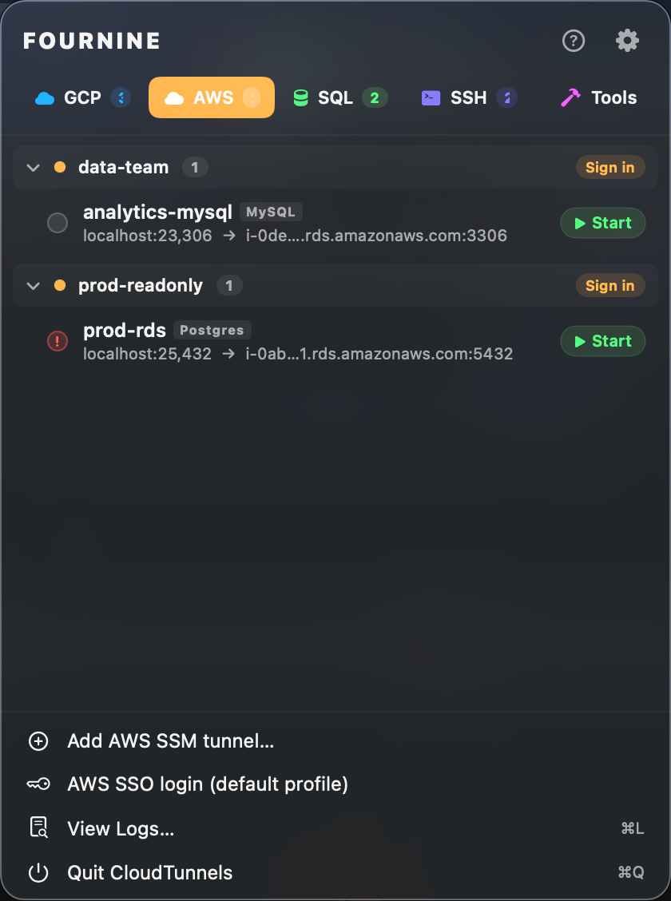
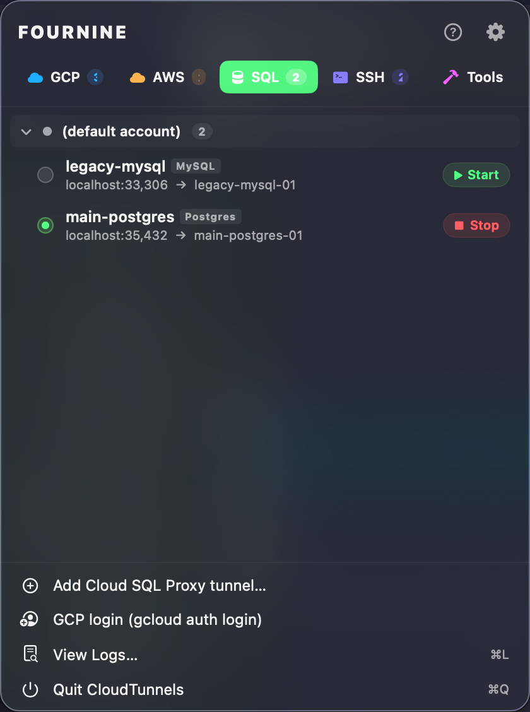
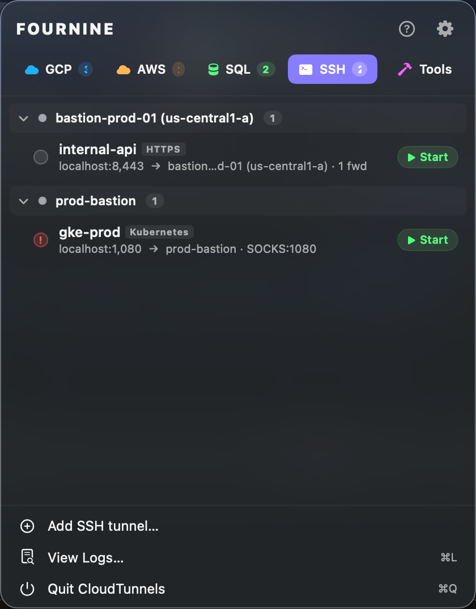
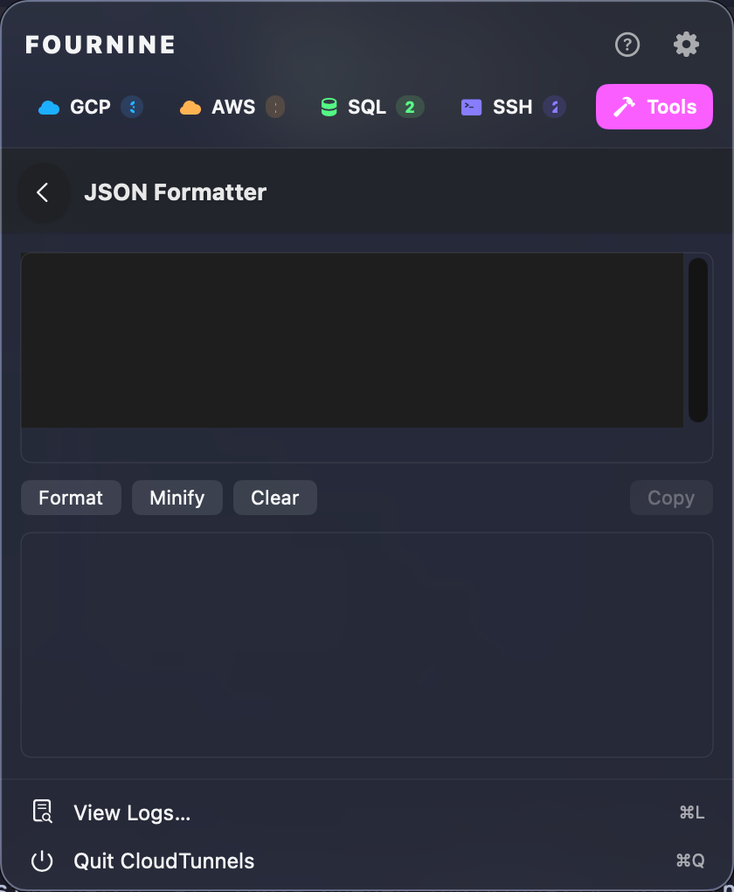
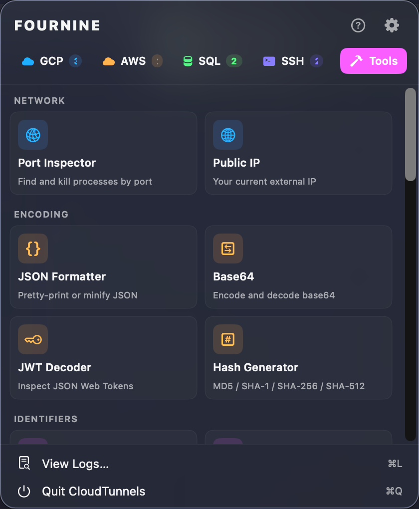
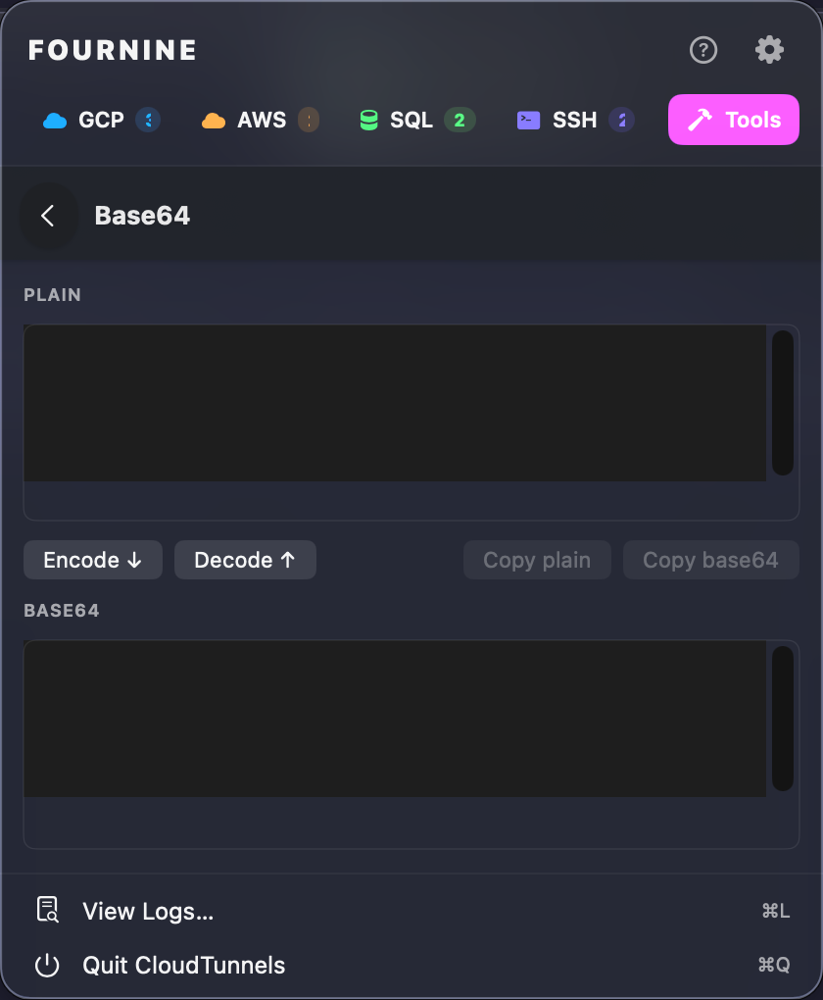
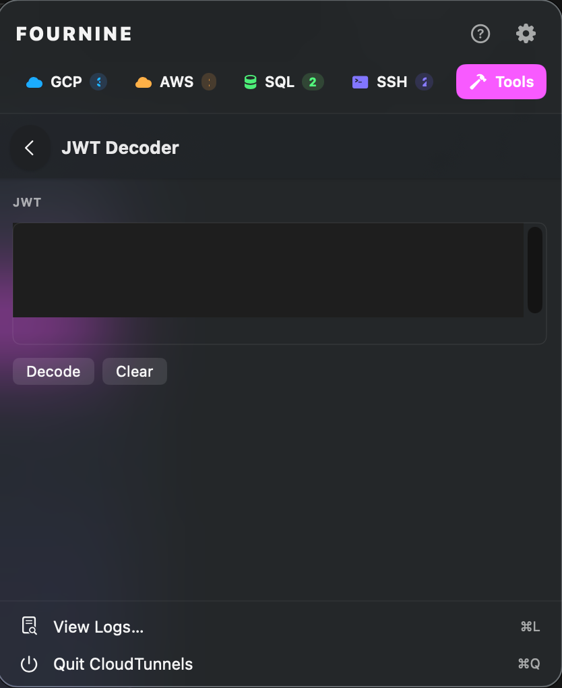

# CloudTunnels

Native macOS menu bar app for managing port-forwarding tunnels across **GCP
IAP**, **AWS Session Manager**, **Cloud SQL Auth Proxy**, and **SSH**. Shells
out to `gcloud compute start-iap-tunnel`, `aws ssm start-session`,
`cloud-sql-proxy`, and `ssh` (or `gcloud compute ssh` for IAP-wrapped SSH).
Manages tunnel lifecycle, multi-account auth state, auto-reconnect, and
notifications. Includes a `ctun` CLI for scripting and headless use.

Bundle ID: `com.fourninecloud.cloud-tunnels`. On first launch, config is
auto-migrated from the previous `GCPIAPTunnel` Application Support directory
(and before that, the Python `~/.gcp-iap-tunnels` dotfile) — existing users
keep their tunnels on upgrade.

## Screenshots

| GCP IAP | AWS SSM | Cloud SQL | SSH |
|---|---|---|---|
|  |  |  |  |

| Tools overview | Port Inspector | JSON Formatter | JWT Decoder |
|---|---|---|---|
|  |  |  |  |

## Requirements

- macOS 13 Ventura or later
- Xcode 15+ (command line tools provide `swift`)
- For GCP tunnels: `gcloud` CLI on `PATH` (or under `/usr/local/bin`,
  `/opt/homebrew/bin`, `~/google-cloud-sdk/bin`)
- For AWS tunnels: `aws` CLI **and** `session-manager-plugin`. Install with
  `brew install awscli` and follow
  [AWS docs](https://docs.aws.amazon.com/systems-manager/latest/userguide/session-manager-working-with-install-plugin.html)
  for the SSM plugin.
- For Cloud SQL Proxy tunnels: `cloud-sql-proxy` v2 on `PATH` (or under
  `/usr/local/bin`, `/opt/homebrew/bin`, `~/bin`). Install with
  `brew install cloud-sql-proxy`, then run
  `gcloud auth application-default login` once to set up ADC.
- For SSH tunnels: `ssh` is included with macOS. For GCP IAP-wrapped SSH,
  `gcloud` is also required (same as GCP IAP tunnels).

## Build & run

```bash
make test          # swift test
make app           # build Release + package build/CloudTunnels.app
make run           # build + open
make install       # copy to /Applications and strip quarantine
make zip           # build/CloudTunnels.zip (universal)
make zip-arm64     # build/CloudTunnels-arm64.zip  (Apple Silicon)
make zip-x86_64    # build/CloudTunnels-x86_64.zip (Intel)
make zip-all       # both arch zips
```

### Distributing under your own Apple Developer account

Update `APP_BUNDLE_ID` and `HELPER_BUNDLE_ID` in the `Makefile`, then update
`Resources/Info.plist` and `Resources/LaunchDaemons/*.plist` to match, and
set `SIGN_IDENTITY` to your certificate before running `make app`.

## First launch (unsigned)

If you build without a signing identity (the default, `SIGN_IDENTITY=-`),
Gatekeeper will block the first launch:

```bash
xattr -dr com.apple.quarantine /Applications/CloudTunnels.app
```

Or right-click the `.app` → **Open** → **Open** in the dialog. After one
approval, future launches work normally.

## Config location

- Primary: `~/Library/Application Support/CloudTunnels/config.json`
- Legacy (read once, migrated on first launch, in order):
  1. `~/Library/Application Support/GCPIAPTunnel/config.json` (pre-rename Swift build)
  2. `~/.gcp-iap-tunnels/config.json` (Python predecessor)

Legacy files are left in place as a rollback. To roll back, delete the
new-location file.

## Logs

All structured logs go to `os.Logger` with subsystem
`com.fourninecloud.cloud-tunnels`. Tail them live with:

```bash
log stream --predicate 'subsystem == "com.fourninecloud.cloud-tunnels"' --info
```

Or open **Console.app** and filter by the subsystem.

## Architecture

| Layer | Files |
|---|---|
| Models | `Sources/TunnelCore/Models/{Tunnel,ProviderConfig,TunnelStatus,Preferences}.swift` |
| Launchers | `Sources/TunnelCore/{GCPIAPLauncher,AWSSSMLauncher,CloudSQLProxyLauncher,SSHLauncher}.swift` |
| Core | `Sources/CloudTunnels/Core/{AuthManager,AWSAuthManager,TunnelManager}.swift` |
| UI | `Sources/CloudTunnels/UI/{MenuBarView,AddEditTunnelView,PreferencesView,HelpView}.swift` |
| Services | `Sources/CloudTunnels/Services/{Notifications,QuickAction,CalendarManager}.swift` |
| App entry | `Sources/CloudTunnels/App/CloudTunnelsApp.swift` |
| CLI | `Sources/ctun/` |
| Tests | `Tests/CloudTunnelsTests/*.swift` |

## Providers

Each saved tunnel is tagged with one of four providers:

### GCP IAP

Wraps `gcloud compute start-iap-tunnel`. Each tunnel can pin to a specific
gcloud account via the **gcloud account** picker, so two tunnels can run under
two different accounts simultaneously without re-logging in. Add accounts with
the **GCP login** button (runs `gcloud auth login`).

### AWS SSM

Wraps `aws ssm start-session`. Two modes:

- **Direct-to-instance**: leave the *Remote host* field blank. Uses the
  `AWS-StartPortForwardingSession` document to forward a port on the target EC2
  itself (e.g. SSH to a bastion).
- **Bastion → remote host**: fill in *Remote host*. Uses the
  `AWS-StartPortForwardingSessionToRemoteHost` document to tunnel through the
  target to a different host like an RDS database.

Each tunnel can pin to a specific AWS CLI profile and override the region. Sign
in to SSO profiles via the **AWS SSO** button (runs `aws sso login --profile=X`).

The app discovers profiles from `aws configure list-profiles` and verifies each
one with `aws sts get-caller-identity --profile=X`. It does **not** edit
`~/.aws/config` — manage profiles via the AWS CLI as usual.

### Cloud SQL Auth Proxy

Wraps `cloud-sql-proxy` v2 for local connections to Cloud SQL instances
(Postgres, MySQL, SQL Server). Uses Application Default Credentials — run
`gcloud auth application-default login` once before connecting. Each tunnel
takes an **instance connection name** in the form `project:region:instance`
plus a local listen port, and exposes toggles for:

- **Use private IP** — passes `--private-ip`, for reaching Cloud SQL over
  VPN/peered networks instead of the public endpoint.
- **Auto IAM authentication** — passes `--auto-iam-authn`, so the proxy
  injects an OAuth token as the DB password for IAM DB users.
- **Impersonate service account** — passes `--impersonate-service-account`
  to run the proxy as a specified service account.

The tunnel reuses the existing **gcloud account** picker; selecting an account
forwards `CLOUDSDK_CORE_ACCOUNT` to `cloud-sql-proxy` so ADC resolves to that
identity. Install the binary with `brew install cloud-sql-proxy`.

### SSH

Plain SSH port forwarding and SOCKS5 proxy tunnels. Two upstream modes:

- **SSH config alias** — uses a `Host` entry from `~/.ssh/config`. The alias
  dropdown is populated automatically from your config file.
- **GCP IAP-wrapped SSH** — wraps `gcloud compute ssh` with `--tunnel-through-iap`
  to reach instances with no public IP.

Each SSH tunnel can bind any combination of:
- **SOCKS5 port** (`-D`) — routes `kubectl`, a browser, or any SOCKS-aware client
  through the tunnel.
- **Local forwards** (`-L`) — forward individual ports to remote hosts reachable
  from the bastion.

**Kubeconfig patching** — when a SOCKS port is set, CloudTunnels can automatically
patch a kubeconfig cluster entry with `proxy-url=socks5://127.0.0.1:<port>` on
connect and remove it on disconnect, so `kubectl` works without manual edits.

## Smoke test checklist

1. `make test` — all unit tests pass
2. `make run` — icon appears in the menu bar
3. **GCP**: click **GCP Login** → `gcloud auth login` opens browser, icon badge updates
4. **Add Tunnel…** → fill a real IAP-reachable instance → Save → Start →
   `lsof -i :LOCALPORT` shows the `gcloud` process bound to your local port
5. Click **Stop** → process exits, port freed
6. `gcloud auth revoke <account>` while a GCP tunnel runs → tunnel dies,
   notification fires, auto-reconnect does **not** kick in
7. **SSH**: add a tunnel using a `~/.ssh/config` alias with a SOCKS port →
   Start → verify `kubectl` routes through the proxy
8. Quit the app → `pgrep -f "start-iap-tunnel\|cloud-sql-proxy"` is empty
