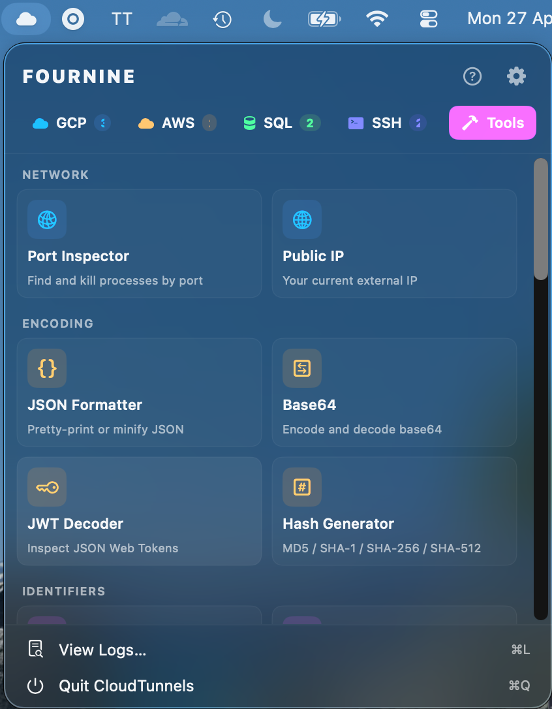
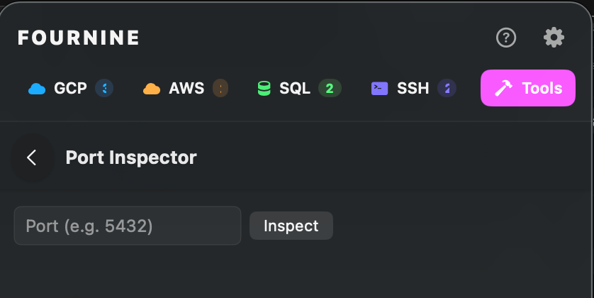
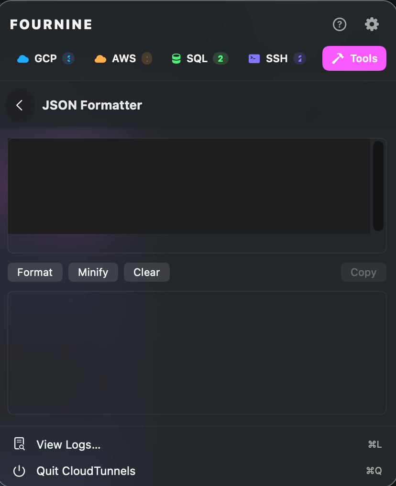
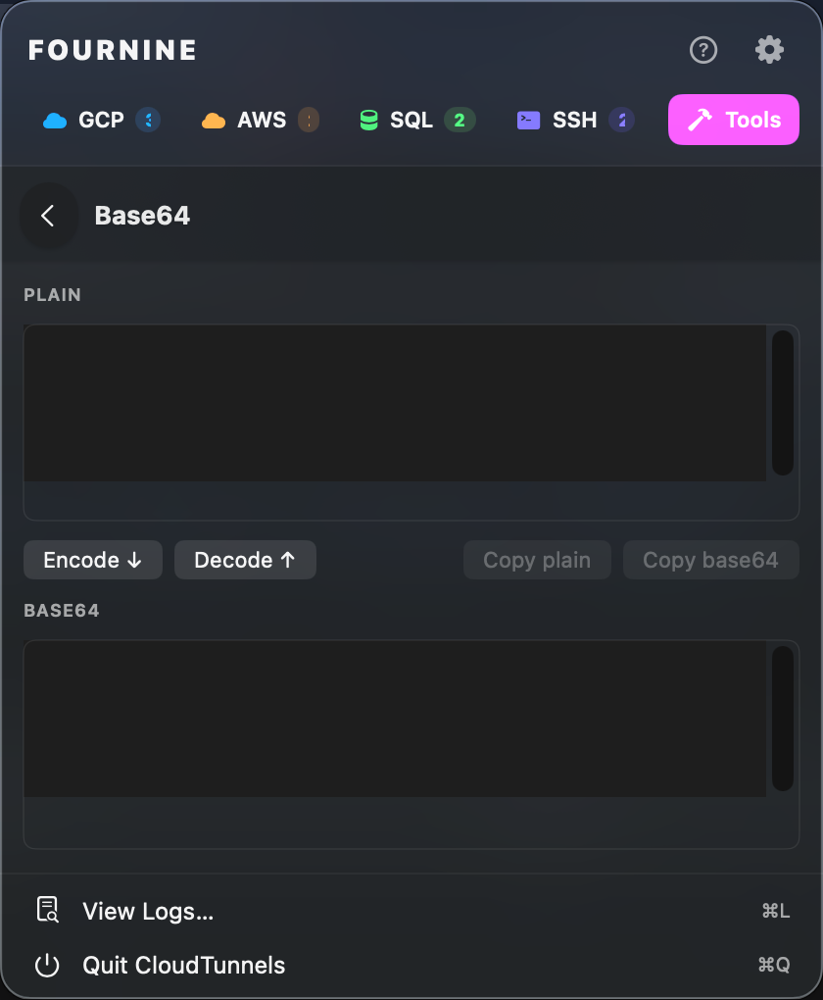

# CloudTunnels User Guide

## Table of Contents

1. [Installation](#installation)
2. [The Menu Bar](#the-menu-bar)
3. [Managing Tunnels](#managing-tunnels)
4. [Providers](#providers)
5. [Connecting and Status](#connecting-and-status)
6. [Tunnel Kinds and Quick Actions](#tunnel-kinds-and-quick-actions)
7. [Preferences](#preferences)
8. [Calendar and Meeting Reminders](#calendar-and-meeting-reminders)
9. [Tools Tab](#tools-tab)
10. [ctun CLI](#ctun-cli)
11. [Logs and Troubleshooting](#logs-and-troubleshooting)

---

## Installation

### Build from source

```bash
git clone https://github.com/sampathinturi/cloud-tunnels.git
cd cloud-tunnels
make app          # produces build/CloudTunnels.app
make install      # copies to /Applications
```

### First launch

If built without a code-signing identity, Gatekeeper blocks the first launch.
Either run:

```bash
xattr -dr com.apple.quarantine /Applications/CloudTunnels.app
```

Or right-click the `.app` → **Open** → **Open** in the dialog. This approval
is remembered; future launches open normally.

### CLI (`ctun`)

```bash
make install-cli   # installs ctun to /usr/local/bin
ctun --help
```

### Dependencies by provider

| Provider | Required CLI |
|---|---|
| GCP IAP | `gcloud` |
| AWS SSM | `aws` + `session-manager-plugin` |
| Cloud SQL Auth Proxy | `cloud-sql-proxy` v2 |
| SSH (IAP mode) | `gcloud` |
| SSH (alias mode) | built-in `ssh` — no extras needed |

Install GCP tools: `brew install google-cloud-sdk`
Install AWS tools: `brew install awscli` + [SSM plugin](https://docs.aws.amazon.com/systems-manager/latest/userguide/session-manager-working-with-install-plugin.html)
Install Cloud SQL Proxy: `brew install cloud-sql-proxy`

---

## The Menu Bar

CloudTunnels lives entirely in the macOS menu bar — no Dock icon.


### Status icon

| Icon | Meaning |
|---|---|
| Cloud outline | No tunnels running |
| Cloud filled | One or more tunnels connected |
| Cloud with warning | One or more tunnels in error state |

Clicking the icon opens the popover. The popover has five tabs along the top:
**GCP**, **AWS**, **SQL**, **SSH**, and **Tools**.

### Meeting banner

If Calendar integration is enabled, a banner showing your next meeting appears
above the tab bar. It shows the meeting title, start time, and a **Join** button
if a Zoom / Google Meet / Teams / Webex link is found in the event. The banner
is visible from every tab.

---

## Managing Tunnels

### Adding a tunnel

1. Click the **+** button at the bottom of any provider tab (or **Add Tunnel…**
   in the footer).
2. Pick the provider from the segmented control at the top of the form.
3. Fill in the fields for that provider (see [Providers](#providers)).
4. Set the **Tunnel kind** — this controls the quick action button
   (see [Tunnel Kinds](#tunnel-kinds-and-quick-actions)).
5. Optionally fill in **Action config** fields (username, database, path)
   used by the quick action.
6. Toggle **Auto-connect** to start this tunnel automatically when the app launches.
7. Click **Save**.

The local port field auto-fills with a free port so you never have to hunt for
one manually.

### Editing a tunnel

Click the **⋯** menu on any tunnel row → **Edit**. All fields are editable while
the tunnel is stopped. Changes take effect on the next connect.

### Deleting a tunnel

Click **⋯** → **Delete**. This removes it from `config.json` immediately.

### Reordering tunnels

Drag tunnels within a tab to reorder them. Order is saved automatically.

---

## Providers

### GCP IAP

Wraps `gcloud compute start-iap-tunnel`.

| Field | Description |
|---|---|
| Instance | Compute Engine instance name |
| Instance port | Port on the instance (e.g. `22` for SSH, `5432` for Postgres) |
| Zone | GCP zone (e.g. `us-central1-a`) |
| Project | GCP project ID |
| gcloud account | Optional. Pin to a specific gcloud account. Leave blank to use the gcloud default. |
| Local port | Port on `127.0.0.1` to listen on |

**Auth**: Click **GCP Login** in the tab footer to run `gcloud auth login`. The
badge on the GCP tab turns green when at least one account is active. The app
checks account health every 30 minutes (configurable in Preferences).

Multiple accounts can be active simultaneously — two GCP tunnels can run under
two different accounts without interference.

---

### AWS SSM


Wraps `aws ssm start-session`.

| Field | Description |
|---|---|
| Target | EC2 instance ID (e.g. `i-0abc1234567890`) or ECS task ARN |
| Remote host | Leave blank for direct port-forward; fill in a hostname for bastion→host mode |
| Remote port | Port on the target or the remote host |
| Profile | AWS CLI profile name. Leave blank for the default profile. |
| Region | AWS region override. Leave blank to use the profile's default. |
| Local port | Port on `127.0.0.1` to listen on |

**Two forwarding modes:**
- **Direct**: blank Remote host → uses `AWS-StartPortForwardingSession`. Forwards a port directly on the EC2 instance.
- **Bastion → remote**: fill in Remote host → uses `AWS-StartPortForwardingSessionToRemoteHost`. Routes through the SSM instance to a separate host (e.g. an RDS endpoint).

**Auth**: Click **AWS SSO** in the tab footer to run `aws sso login --profile=<name>`. The app discovers all profiles via `aws configure list-profiles` and validates each with `aws sts get-caller-identity`. Invalid profiles show a red badge.

---

### Cloud SQL Auth Proxy


Wraps `cloud-sql-proxy` v2.

| Field | Description |
|---|---|
| Instance connection name | `project:region:instance` (find in the Cloud Console → SQL → instance details) |
| Local port | Port on `127.0.0.1` to listen on |
| Use private IP | Passes `--private-ip`. Use when connecting over VPC peering or a VPN. |
| Auto IAM authentication | Passes `--auto-iam-authn`. The proxy injects an OAuth token as the DB password — no manual password needed for IAM DB users. |
| Impersonate service account | Passes `--impersonate-service-account`. Run the proxy as a service account identity instead of your personal ADC. |
| gcloud account | Forwards `CLOUDSDK_CORE_ACCOUNT` to `cloud-sql-proxy` so ADC resolves to the selected account. |

**Auth**: Run `gcloud auth application-default login` once in a terminal before connecting. CloudTunnels does not manage ADC setup.

---

### SSH


Plain SSH forwarding and SOCKS5 tunnels.

#### Upstream mode

**SSH config alias** — selects a `Host` from `~/.ssh/config`. The alias
dropdown is populated automatically. Any ProxyJump chains defined in your
config are honoured by `ssh` as usual.

**GCP IAP-wrapped SSH** — wraps `gcloud compute ssh --tunnel-through-iap`.
Useful for instances with no public IP. Extra fields:

| Field | Description |
|---|---|
| Instance | Compute Engine instance name |
| Zone | GCP zone |
| Project | GCP project ID |
| gcloud account | Optional. Pin to a specific account. |

#### Port configuration

An SSH tunnel can bind any combination of:

- **SOCKS5 port** — binds `127.0.0.1:<port>` as a SOCKS5 proxy (`-D`). Route
  `kubectl`, a browser, or any SOCKS-aware client through the tunnel.
- **Local forwards** — one or more `-L` forwards in the form
  `localPort → remoteHost:remotePort`. The remote host is resolved from the
  bastion, not your machine.

At least one of SOCKS or a local forward is required.

#### Kubeconfig patching

When a SOCKS port is configured, CloudTunnels can automatically patch a
kubeconfig cluster entry on connect and restore it on disconnect.

| Field | Description |
|---|---|
| Cluster name | Must match an existing entry in `kubectl config get-clusters`. The dropdown is populated automatically. |
| Skip TLS verify | Adds `insecure-skip-tls-verify=true`. Needed when the API server uses an internal or self-signed cert. |
| Kubeconfig path | Leave blank to use the default `~/.kube/config`. |

On connect, CloudTunnels runs:
```
kubectl config set-cluster <name> --proxy-url=socks5://127.0.0.1:<port>
```

On disconnect, it runs:
```
kubectl config unset clusters.<name>.proxy-url
kubectl config unset clusters.<name>.insecure-skip-tls-verify
```

This means `kubectl get pods` just works through the tunnel without any manual
kubeconfig edits.

---

## Connecting and Status

### Starting a tunnel

Click **Start** (▶) on any tunnel row. The status transitions:

```
idle → connecting → connected
```

**Connecting**: the child process (`gcloud`, `aws`, `ssh`, etc.) has been
spawned. CloudTunnels watches stderr for a "listening on port" marker.

**Connected**: the marker was found, or the fallback timer fired (for launchers
that stay silent on stderr). The local port is now accepting connections.

### Stopping a tunnel

Click **Stop** (■). The child process is sent SIGTERM, the port is freed, and
status returns to idle.

### Auto-reconnect

When a tunnel exits unexpectedly (network drop, instance restart), CloudTunnels
automatically reconnects up to **3 times with a 10-second delay**. Auto-reconnect
is skipped if the exit was caused by auth expiry (to avoid a reconnect loop that
would immediately fail again).

Disable auto-reconnect globally in **Preferences → Auto-reconnect**.

### Auth expiry detection

CloudTunnels watches stderr for patterns like:

- `ERROR: (gcloud.compute.start-iap-tunnel) There was a problem refreshing your current auth tokens`
- `Token has been expired or revoked`
- `UnauthorizedException`
- And several others per provider

When detected, the tunnel moves to **Auth expired** state, auto-reconnect is
suppressed, and a macOS notification is sent prompting you to re-authenticate.

### Auto-connect on launch

Any tunnel with **Auto-connect** enabled starts automatically when the app
launches. They start in parallel, not sequentially.

---

## Tunnel Kinds and Quick Actions

Each tunnel has a **Kind** that describes what service is behind it. The kind
drives the quick action button (the icon button on the right of a connected
tunnel row).

| Kind | Quick action |
|---|---|
| **TCP** | Copy `localhost:<port>` to clipboard |
| **SSH** | Open `ssh user@localhost -p <port>` in your terminal |
| **HTTP** | Open `http://localhost:<port>/<path>` in browser |
| **HTTPS** | Open `https://localhost:<port>/<path>` in browser |
| **Kubernetes** | Open `k9s` (preferred) or `kubectl` in your terminal |
| **RDP** | Generate and open a `.rdp` file in Microsoft Remote Desktop |
| **VNC** | Open `vnc://localhost:<port>` in Screen Sharing |
| **Postgres** | Open `psql://localhost:<port>/<database>` in your Postgres client |
| **MySQL** | Open `mysql://localhost:<port>/<database>` in your MySQL client |
| **MongoDB** | Open `mongodb://localhost:<port>` in MongoDB Compass |
| **Redis** | Open `redis-cli -h localhost -p <port>` in your terminal |
| **Vault** | Open `http://localhost:<port>/ui` in browser |
| **Elasticsearch** | Open `http://localhost:<port>` in browser |
| **Kafka** | Copy `localhost:<port>` Kafka bootstrap address to clipboard |

**Action config fields** (set in the Add/Edit form):

| Field | Used by |
|---|---|
| Username | SSH (prepended as `user@`), RDP |
| Database | Postgres, MySQL, MongoDB |
| Path | HTTP, HTTPS (appended to the URL) |

The quick action auto-starts the tunnel if it is not already running, waits up
to 30 seconds for it to reach connected state, then fires the action.

**Terminal app preference** controls where SSH, Redis, and Kubernetes terminal
actions open: Terminal.app, iTerm2, or Ghostty.

**HTTP client preference** controls where HTTP/HTTPS actions open: your system
default browser or Bruno (API client).

---

## Preferences

Open via the gear icon at the bottom of the popover.

| Setting | Default | Description |
|---|---|---|
| Auto-reconnect | On | Automatically retry when a tunnel exits unexpectedly (max 3×, 10s apart). |
| Auth check interval | 30 min | How often to validate GCP and AWS credentials in the background. |
| Terminal app | Terminal | App used for SSH, Redis, and Kubernetes quick actions. Options: Terminal, iTerm2, Ghostty. |
| HTTP client | System browser | App used for HTTP/HTTPS quick actions. Options: System browser, Bruno. |
| Calendar | Enabled | Master switch for meeting reminders (see below). |
| Lookahead days | 2 | How many days ahead to surface meetings. |
| Refresh interval | 5 min | How often to re-query Calendar.app for changes. |
| Reminder lead times | 30, 10, 1 min | Minutes before a meeting starts to fire a reminder. |
| Show all-day events | Off | Include all-day events (birthdays, OOO) in the meeting list. |

---

## Calendar and Meeting Reminders

CloudTunnels reads your macOS Calendar.app data (via EventKit) and surfaces
upcoming meetings directly in the menu bar.

### Setup

On first launch with Calendar enabled, macOS will prompt for Calendar access.
Grant it. If you accidentally denied it, go to **System Settings → Privacy &
Security → Calendars** and enable CloudTunnels.

> **Note for developers building from source**: ad-hoc signing
> (`SIGN_IDENTITY=-`) blocks all TCC privacy prompts on macOS Ventura 14+ and
> Sequoia. Build with a real Apple Developer identity to get the Calendar
> permission prompt. See the Makefile's `SIGN_IDENTITY` variable.

### Meeting banner

A banner above the tab bar shows your next upcoming meeting:
- Title, calendar color, and start time (or "in X min")
- **Join** button — extracts the first meeting link found in the event
  (Zoom, Google Meet, Microsoft Teams, Webex) and opens it in your browser.

### Reminders

At each configured lead time (default 30, 10, 1 minutes before start):
- **Popover is open**: a toast notification appears inside the app.
- **Popover is closed**: a macOS system notification fires with a **Join** action
  button that opens the meeting link directly.

Reminders are deduplicated — each lead time fires at most once per event per session.

### Calendar tool

The **Tools → Productivity → Calendar** tool shows a full list of upcoming events
within the lookahead window with their times, calendar names, and join links.

---

## Tools Tab

The **Tools** tab is a built-in utility suite organized into seven categories.
All tools run locally — no data leaves your machine except where explicitly noted.



---

### Network

#### Port Inspector



Find which process is holding a port and kill it if needed.
- Enter a port number → see the PID and process name bound to it.
- **Kill** button sends SIGTERM. Useful when a previous tunnel crash left a
  port occupied.

#### Public IP
Fetches and displays your current external IP address via a public IP echo service.

---

### Encoding

#### JSON Formatter



Pretty-print or minify JSON.
- Paste raw JSON → click **Format** for indented output or **Minify** for
  compact output.
- Syntax errors are highlighted with the offending line noted.

#### Base64



Encode or decode Base64 strings.
- Toggle between **Encode** and **Decode** mode.
- Handles both standard and URL-safe Base64.

#### JWT Decoder


Inspect a JSON Web Token without a library.
- Paste a JWT → header and payload are decoded and pretty-printed.
- Expiry (`exp`) is shown in human-readable local time with an
  **expired / valid / expires in X min** badge.
- Signature is not verified (this is a decode-only tool).

#### Hash Generator
Hash any input string with MD5, SHA-1, SHA-256, or SHA-512.
- Output updates live as you type.
- Copy button next to each hash.

---

### TLS / SSL

#### SSL Checker
Inspect the live TLS certificate served by any host.
- Enter `host:port` (port defaults to 443).
- Shows the full certificate chain: subject, issuer, SANs, validity period,
  and days until expiry.
- **Copy PEM** button exports each certificate in the chain as a PEM block.

#### Certificate Decoder
Decode a PEM certificate block without connecting to any server.
- Paste a `-----BEGIN CERTIFICATE-----` block.
- Decoded fields: subject, issuer, SANs, serial, key algorithm, key size,
  signature algorithm, validity dates, expiry countdown.

#### CSR Decoder
Inspect a Certificate Signing Request (CSR).
- Paste a `-----BEGIN CERTIFICATE REQUEST-----` block.
- Shows subject DN, SANs, and key info requested in the CSR.

#### Certificate Key Matcher
Verify that a private key and certificate belong to the same key pair.
- Paste both PEM blocks → green checkmark if the public keys match, red X if not.
- Catches mismatched certs and keys before deploying.

#### SSL Converter
Convert between PEM and DER certificate formats.
- Paste a PEM block → download/copy as DER (binary), or vice versa.

---

### Identifiers

#### UUID Generator
Generate multiple UUIDv4 identifiers at once.
- Set the count (1–100) → click **Generate**.
- **Copy all** copies the full list as newline-separated UUIDs.

#### Timestamp
Convert between Unix epoch seconds and ISO 8601 / human-readable dates.
- Enter an epoch number → see the UTC and local date/time.
- Enter a date string → see the epoch.
- **Now** button fills in the current epoch.

---

### Generation

#### Password Generator
Generate strong random passwords.
- Configure length and character sets (uppercase, lowercase, digits, symbols).
- **Copy** button copies the password to the clipboard.
- Regenerate with one click.

#### JWT / HMAC Secret
Generate cryptographically secure signing keys for JWTs and HMAC.
- Outputs a random key as Base64, hex, or raw bytes.
- Suitable for use as `HS256` / `HS512` secrets or general HMAC keys.

#### Share Secret
Send a secret value as a one-time link via [onetimesecret.com](https://onetimesecret.com).
- Paste a secret → click **Create link** → a URL is generated.
- The link can only be read once; after that it is destroyed.
- Useful for sharing DB passwords, API keys, or credentials securely.
- *Note: the secret is sent to onetimesecret.com's API. Do not use for
  secrets subject to strict data-residency requirements.*

---

### Cloud

#### kubectl Context
Switch the active Kubernetes context with one click.
- Lists all contexts from your kubeconfig.
- Click any context to run `kubectl config use-context <name>`.
- The current context is highlighted.

#### Kubeconfig Inspector
A read-only view of your full kubeconfig at a glance.
- Shows all clusters, contexts, and users in a structured table.
- Highlights the current context.
- Shows `proxy-url` on clusters patched by CloudTunnels SSH tunnels.

#### Cluster Health
Probe every kubeconfig context for reachability.
- Runs a lightweight API server check against each context.
- Reports: reachable, unreachable, or auth error — with response time.
- Useful for quickly checking which clusters are accessible before a session.

#### K8s Secret Coder
Encode or decode Kubernetes Secret YAML without `base64` in the shell.
- **Encode**: paste a YAML map of plain-text key/value pairs → outputs a
  valid `data:` block with Base64-encoded values ready to paste into a Secret manifest.
- **Decode**: paste a `data:` block → shows plain-text values.

#### Cron Expression
Decode and preview a cron expression.
- Enter any standard 5-field cron expression.
- Shows a human-readable description ("every day at 9 AM UTC").
- Lists the next 10 fire times in local time.

---

### Productivity

#### Scratchpad
A persistent text area for quick notes.
- Contents survive app restarts (stored in `UserDefaults`).
- No formatting — plain text only.
- Good for keeping connection strings, one-off commands, or notes
  about a running session.

#### Calendar
Full list of upcoming meetings within your configured lookahead window.
- Shows title, calendar name, start/end time, and join link if present.
- Same data as the menu bar banner but with the full event list visible at once.

---

## ctun CLI

`ctun` is the companion command-line interface. It reads the same
`config.json` the GUI app writes, so tunnels configured in the GUI are
immediately available in the shell.

### Commands

```
ctun list                  # list all configured tunnels with their provider and port
ctun start <name>          # start a tunnel in the foreground (Ctrl-C to stop)
ctun start <name> --detach # start a tunnel as a background process
ctun stop <name>           # stop a detached tunnel (or signal the GUI app to stop it)
ctun status                # show status of all tunnels (running / stopped)
ctun status <name>         # show status of a specific tunnel
ctun config path           # print the path of config.json
ctun config show           # pretty-print the contents of config.json
```

### Foreground mode

`ctun start <name>` runs the tunnel process in the foreground and streams
status to stdout. `Ctrl-C` sends SIGTERM to the tunnel child and exits cleanly.

```bash
$ ctun start prod-db
[connecting] prod-db → localhost:15432
[connected]  prod-db is ready
^C
[stopped]    prod-db
```

### Detached mode

`ctun start <name> --detach` spawns the tunnel as a background process and
returns immediately. A PID file is written so `ctun stop` can find it later.

```bash
ctun start prod-db --detach
ctun status prod-db
ctun stop prod-db
```

### GUI integration

`ctun stop <name>` first checks for a PID file (detached mode). If none is
found, it sends a `DistributedNotification` that the menu-bar app receives and
uses to perform a clean disconnect — including kubeconfig restore for SSH tunnels.

This means you can stop a tunnel the GUI started:

```bash
ctun stop prod-db   # works even if the GUI launched it
```

### Limitations

- The Local HTTPS Proxy feature (Caddy-based) is GUI-only. `ctun` skips it and
  prints a warning if the tunnel has a proxy configured.
- `ctun` does not manage GCP or AWS auth — run `gcloud auth login` /
  `aws sso login` separately before starting tunnels that need auth.

---

## Logs and Troubleshooting

### Live log stream

```bash
log stream --predicate 'subsystem == "com.fourninecloud.cloud-tunnels"' --info
```

Or open **Console.app** and filter by subsystem `com.fourninecloud.cloud-tunnels`.

### In-app logs

Click the **Logs** button in the popover footer to open a log window that shows
recent events for all tunnels in the current session.

### Common issues

**Tunnel stays in "Connecting" indefinitely**
- Check that the required CLI (`gcloud`, `aws`, `cloud-sql-proxy`, `ssh`) is on your PATH or under `/usr/local/bin`, `/opt/homebrew/bin`.
- For GCP IAP: run `gcloud auth list` — ensure the pinned account is active.
- For AWS SSM: run `aws sts get-caller-identity --profile=<name>` to verify the profile is valid.
- For SSH: run the `ssh` command manually from a terminal to confirm the alias resolves.

**Port already in use**
- Use the **Port Inspector** tool (Tools → Network) to find and kill the holder.
- Or `lsof -ti :<port> | xargs kill` in a terminal.

**"Auth expired" notification keeps appearing**
- Re-authenticate: **GCP Login** button, or `aws sso login --profile=<name>`.
- Increase the auth check interval in Preferences if you're getting false positives.

**kubectl doesn't work through an SSH SOCKS tunnel**
- Check the cluster name in the SSH tunnel matches the exact entry in `kubectl config get-clusters`.
- Verify `kubectl config view` shows `proxy-url: socks5://127.0.0.1:<port>` on the cluster.
- If the cluster uses an internal cert, enable **Skip TLS verify** on the kubeconfig patch.
- Run `tccutil reset All com.fourninecloud.cloud-tunnels` if a macOS permission prompt was missed.

**Calendar access never prompted**
- The app must be signed with a real Apple Developer identity (not ad-hoc `-`) for TCC to show the prompt on macOS Ventura 14+.
- After re-signing, run `tccutil reset Calendar com.fourninecloud.cloud-tunnels` to clear any prior denial before relaunching.

**Config file location**
- Primary: `~/Library/Application Support/CloudTunnels/config.json`
- Legacy (auto-migrated on first launch):
  - `~/Library/Application Support/GCPIAPTunnel/config.json`
  - `~/.gcp-iap-tunnels/config.json`
